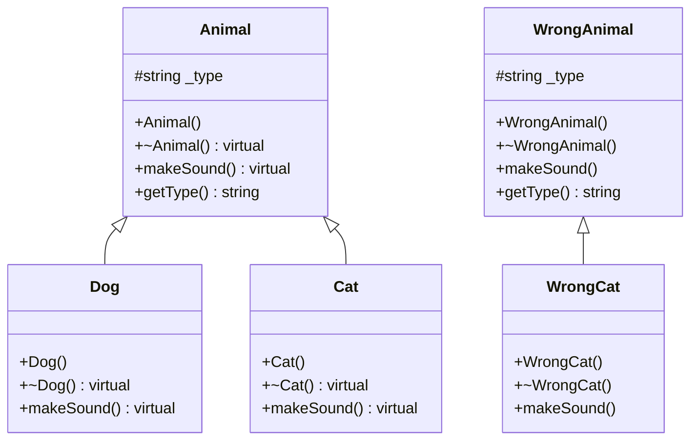
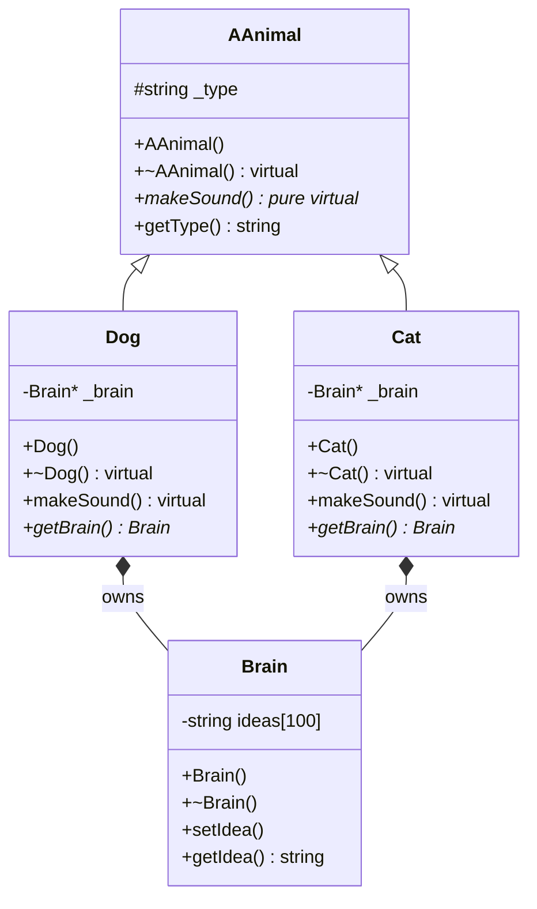

# CPP Module 04 — Polymorphisme, Classes Abstraites & Interfaces

> **Objectif** : Comprendre le polymorphisme de sous-type en C++98, les classes abstraites
> et le mécanisme caché derrière le mot-clé `virtual`.

---

## Table des matières

1. [Les concepts fondamentaux](#les-concepts-fondamentaux)
2. [Exercise 00 — Polymorphism](#exercise-00--polymorphism)
3. [Exercise 01 — I don't want to set the world on fire](#exercise-01--i-dont-want-to-set-the-world-on-fire)
4. [Exercise 02 — Abstract class](#exercise-02--abstract-class)
5. [Résumé visuel de la hiérarchie](#résumé-visuel-de-la-hiérarchie)
6. [Questions fréquentes en évaluation](#questions-fréquentes-en-évaluation)

---

## Les concepts fondamentaux

Avant d'entrer dans les exercices, il faut comprendre **4 piliers** qui traversent tout le module :

### 1. L'héritage (Inheritance)

```
    Animal          ← classe de base (parent)
    /    \
  Dog    Cat        ← classes dérivées (enfants)
```

Quand `Dog` hérite de `Animal`, il **récupère tout** ce que `Animal` possède (attributs, méthodes).
Il peut ensuite **ajouter** ses propres membres ou **redéfinir** ceux du parent.

### 2. Le polymorphisme (Polymorphism)

Le mot vient du grec : *poly* (plusieurs) + *morphe* (formes).

**L'idée** : Un pointeur de type `Animal*` peut en réalité pointer vers un `Dog` ou un `Cat`.
Quand on appelle `makeSound()` dessus, **c'est le type réel de l'objet qui décide**
quelle version de la fonction est exécutée — pas le type du pointeur.

```cpp
Animal* ptr = new Dog();   // ptr est de type Animal*, mais l'objet est un Dog
ptr->makeSound();          // → "Woof! Woof!" (pas le son générique d'Animal)
```

> **IMPORTANT** : Ceci ne fonctionne QUE si `makeSound()` est déclaré `virtual` dans la classe de base.
> Sans `virtual`, le compilateur regarde le type du **pointeur** (Animal), pas le type de **l'objet** (Dog).

### 3. Le mot-clé `virtual` — Ce qui se passe en coulisses

Quand tu mets `virtual` devant une fonction, le compilateur crée une **vtable** (virtual table) :

```
┌─────────────────────────────────────────────────────────┐
│                    Comment ça marche ?                   │
├─────────────────────────────────────────────────────────┤
│                                                         │
│  Sans virtual :                                         │
│  ┌──────────┐                                           │
│  │ Animal*  │──► appelle Animal::makeSound()            │
│  └──────────┘   (résolu à la COMPILATION)               │
│                                                         │
│  Avec virtual :                                         │
│  ┌──────────┐    ┌─────────┐    ┌──────────────────┐    │
│  │ Animal*  │──► │ vtable  │──► │ Dog::makeSound() │    │
│  └──────────┘    └─────────┘    └──────────────────┘    │
│                  (résolu à l'EXÉCUTION)                  │
│                                                         │
└─────────────────────────────────────────────────────────┘
```

**vtable** = un tableau de pointeurs de fonctions que chaque objet possède.
Quand l'objet est un `Dog`, sa vtable pointe vers `Dog::makeSound()`.
Quand c'est un `Cat`, sa vtable pointe vers `Cat::makeSound()`.

C'est ce qu'on appelle le **late binding** (liaison tardive) ou **dynamic dispatch**.

### 4. La Forme Canonique Orthodoxe (Orthodox Canonical Form)

Chaque classe doit avoir ces 4 fonctions :

| Fonction | Rôle |
|----------|------|
| **Constructeur par défaut** | Créer un objet avec des valeurs par défaut |
| **Constructeur de copie** | Créer un nouvel objet à partir d'un existant |
| **Opérateur d'assignation** `=` | Copier les données d'un objet dans un autre déjà existant |
| **Destructeur** | Libérer les ressources quand l'objet est détruit |

---

## Exercise 00 — Polymorphism

> **But** : Comprendre le polymorphisme via `virtual` et prouver ce qui se passe sans.

### Fichiers

| Fichier | Rôle |
|---------|------|
| `Animal.hpp/cpp` | Classe de base avec `virtual makeSound()` |
| `Dog.hpp/cpp` | Hérite d'Animal, type = "Dog", son = "Woof! Woof!" |
| `Cat.hpp/cpp` | Hérite d'Animal, type = "Cat", son = "Meow! Meow!" |
| `WrongAnimal.hpp/cpp` | Classe de base **SANS** `virtual` |
| `WrongCat.hpp/cpp` | Hérite de WrongAnimal |

### L'attribut protégé `_type`

```cpp
class Animal {
protected:          // ← accessible par les classes enfants, mais pas de l'extérieur
    std::string _type;
```

- `protected` = les enfants (`Dog`, `Cat`) peuvent accéder à `_type` directement
- `private` = même les enfants n'y auraient pas accès
- `public` = tout le monde y a accès (mauvaise encapsulation)

### Le destructeur `virtual` — CRUCIAL

```cpp
class Animal {
public:
    virtual ~Animal();   // ← le virtual ici est OBLIGATOIRE
};
```

> **ATTENTION** : Sans `virtual` sur le destructeur, quand tu fais :
> ```cpp
> Animal* ptr = new Dog();
> delete ptr;   // ← SEUL le destructeur d'Animal est appelé !
> ```
> Le destructeur de `Dog` n'est **jamais** appelé → **fuite mémoire** si Dog a des ressources.

**Avec `virtual ~Animal()`** : `delete ptr` appelle d'abord `~Dog()`, puis `~Animal()`.
C'est la **chaîne de destruction correcte**.

### `makeSound()` — virtual vs non-virtual

```cpp
// Dans Animal : virtual → polymorphisme activé
virtual void makeSound() const;

// Dans WrongAnimal : PAS virtual → pas de polymorphisme
void makeSound() const;
```

**Résultat dans le code :**

```cpp
// ✅ Avec virtual (Animal)
const Animal* cat = new Cat();
cat->makeSound();    // → "Meow! Meow!" (appelle Cat::makeSound)

// ❌ Sans virtual (WrongAnimal)
const WrongAnimal* wrongCat = new WrongCat();
wrongCat->makeSound();   // → "* Some generic wrong animal sound *"
                         //    (appelle WrongAnimal::makeSound, PAS WrongCat)
```

### Pourquoi WrongCat existe ?

C'est une **démonstration par l'absurde**. On te demande de créer une version
"cassée" pour que tu comprennes **exactement** ce que `virtual` fait :

| Scénario | `makeSound()` appelé | Pourquoi |
|----------|---------------------|----------|
| `Animal*` → `Cat` | `Cat::makeSound()` | `virtual` → dispatch dynamique |
| `WrongAnimal*` → `WrongCat` | `WrongAnimal::makeSound()` | Pas `virtual` → dispatch statique |
| `WrongCat` directement | `WrongCat::makeSound()` | Pas de pointeur parent → appel direct |

> **Note** : Le WrongAnimal a aussi un **destructeur non-virtual**. C'est intentionnel :
> quand on `delete` un `WrongCat` via un `WrongAnimal*`, seul `~WrongAnimal()` est appelé.
> Le `~WrongCat()` est **ignoré**. C'est un bug classique en C++.

### Constructeurs/Destructeurs — L'ordre d'appel

```
Construction d'un Dog :
  1. Animal::Animal()      ← le parent est construit EN PREMIER
  2. Dog::Dog()            ← puis l'enfant

Destruction d'un Dog :
  1. Dog::~Dog()           ← l'enfant est détruit EN PREMIER
  2. Animal::~Animal()     ← puis le parent
```

**Logique** : On construit les fondations avant le toit, on détruit le toit avant les fondations.

---

## Exercise 01 — I don't want to set the world on fire

> **But** : Comprendre la gestion mémoire avec `new`/`delete` et la **copie profonde** (deep copy).

### Nouveautés par rapport à ex00

| Ajout | Description |
|-------|-------------|
| `Brain` | Classe avec un tableau de 100 `std::string` appelé `_ideas` |
| `Brain*` dans Dog/Cat | Attribut **privé**, alloué avec `new`, libéré avec `delete` |

### La classe Brain

```cpp
class Brain {
private:
    std::string _ideas[100];   // 100 idées stockées

public:
    Brain();
    Brain(const Brain& other);      // copie les 100 idées une par une
    Brain& operator=(const Brain& other);
    ~Brain();

    void setIdea(int index, const std::string& idea);
    std::string getIdea(int index) const;
};
```

### Dog et Cat possèdent un Brain*

```cpp
class Dog : public Animal {
private:
    Brain* _brain;        // ← pointeur vers un objet Brain alloué dynamiquement

public:
    Dog();                // → _brain = new Brain()
    ~Dog();               // → delete _brain
    // ...
};
```

### Le piège : Copie superficielle vs Copie profonde

> **C'est LE concept central de cet exercice. Si tu ne comprends pas ça, tu rates tout.**

#### Copie superficielle (Shallow Copy) — ❌ MAUVAIS

```
Dog original;
original._brain → [Brain à l'adresse 0x1000]

Dog copy(original);     // copie superficielle par défaut
copy._brain → [0x1000]  // MÊME adresse ! Les deux pointent vers LE MÊME Brain !

// Problème 1 : modifier copy modifie aussi original
copy._brain->setIdea(0, "test");  // original est AUSSI modifié !

// Problème 2 : double delete
~Dog() de copy   → delete 0x1000  ✓
~Dog() de original → delete 0x1000  💥 CRASH ! (double free)
```

#### Copie profonde (Deep Copy) — ✅ CORRECT

```
Dog original;
original._brain → [Brain à l'adresse 0x1000]

Dog copy(original);     // copie profonde
copy._brain → [Brain à l'adresse 0x2000]  // NOUVELLE adresse, NOUVEAU Brain !

// Les deux Brain sont indépendants
copy._brain->setIdea(0, "test");  // original n'est PAS modifié ✓

// Pas de double free
~Dog() de copy   → delete 0x2000  ✓
~Dog() de original → delete 0x1000  ✓
```

### Comment implémenter la copie profonde

**Constructeur de copie** — crée un NOUVEAU Brain :

```cpp
Dog::Dog(const Dog& other) : Animal(other), _brain(new Brain(*other._brain))
{                                           // ↑ new Brain = nouvel objet
}                                           //   *other._brain = copie le contenu
```

**Opérateur d'assignation** — réutilise le Brain existant :

```cpp
Dog& Dog::operator=(const Dog& other) {
    if (this != &other) {
        Animal::operator=(other);    // copie la partie Animal
        *_brain = *other._brain;     // copie le CONTENU du Brain (pas le pointeur)
    }                                // ↑ appelle Brain::operator=
    return *this;
}
```

> **Différence subtile** entre les deux :
> - Constructeur de copie : `_brain` n'existe pas encore → on fait `new Brain(...)`
> - Opérateur `=` : `_brain` existe déjà → on copie le contenu avec `*_brain = *other._brain`
>
> Dans l'opérateur `=`, on aurait pu faire `delete _brain; _brain = new Brain(...)` mais
> c'est moins efficace et potentiellement dangereux (si `new` échoue, on a perdu l'ancien Brain).

### Le tableau d'animaux

```cpp
Animal* animals[10];

// Création : moitié Dogs, moitié Cats
for (int i = 0; i < 10; i++) {
    if (i < 5)
        animals[i] = new Dog();    // Dog* stocké dans un Animal*
    else
        animals[i] = new Cat();    // Cat* stocké dans un Animal*
}

// Suppression : delete via Animal* → le destructeur virtual fait le travail
for (int i = 0; i < 10; i++)
    delete animals[i];    // appelle ~Dog() ou ~Cat() grâce au virtual ~Animal()
```

> **IMPORTANT** : Si `~Animal()` n'était **pas virtual**, `delete animals[i]` n'appellerait
> que `~Animal()`. Le `~Dog()` ne serait jamais appelé → le `Brain` ne serait jamais
> `delete` → **fuite mémoire**.

### Ordre de construction/destruction avec Brain

```
Construction d'un Dog :
  1. Animal::Animal()      ← parent
  2. Brain::Brain()        ← le Brain est créé (new Brain dans la liste d'init)
  3. Dog::Dog()            ← corps du constructeur Dog

Destruction d'un Dog (via delete) :
  1. Dog::~Dog()           ← delete _brain est exécuté ici
  2. Brain::~Brain()       ← le Brain est détruit
  3. Animal::~Animal()     ← parent détruit en dernier
```

---

## Exercise 02 — Abstract class

> **But** : Empêcher l'instanciation d'une classe qui n'a pas de sens toute seule.

### Le problème

```cpp
Animal* a = new Animal();   // Quel son fait un "Animal" générique ? Aucun sens.
a->makeSound();             // → "* Some generic animal sound *" ← absurde
```

Un `Animal` tout seul n'existe pas dans la réalité. C'est toujours un chien, un chat, etc.
On veut **interdire** la création d'un `Animal` brut tout en gardant la classe comme base.

### La solution : Fonction virtuelle pure

```cpp
class AAnimal {
public:
    virtual void makeSound() const = 0;   // ← le "= 0" rend la classe ABSTRAITE
};
```

Le `= 0` signifie : **"cette fonction N'A PAS d'implémentation dans cette classe"**.
Les classes enfants sont **obligées** de la définir, sinon elles aussi deviennent abstraites.

### Conséquences

```cpp
AAnimal a;                    // ❌ ERREUR DE COMPILATION
AAnimal* ptr = new AAnimal(); // ❌ ERREUR DE COMPILATION

AAnimal* ptr = new Dog();     // ✅ OK : Dog implémente makeSound()
AAnimal* ptr = new Cat();     // ✅ OK : Cat implémente makeSound()
```

### Le renommage `Animal` → `AAnimal`

Le sujet suggère d'ajouter un préfixe `A` pour indiquer que c'est une classe abstraite.
C'est une **convention** à 42 (pas un standard C++) :

| Préfixe | Signification |
|---------|--------------|
| `A` | Classe **A**bstraite (au moins une fonction virtuelle pure) |
| `I` | **I**nterface (toutes les fonctions sont virtuelles pures, aucun attribut) |

### Ce qui change par rapport à ex01

| ex01 | ex02 |
|------|------|
| `class Animal` | `class AAnimal` |
| `virtual void makeSound() const;` | `virtual void makeSound() const = 0;` |
| `Animal::makeSound()` existe avec un corps | Plus de corps dans AAnimal |
| `new Animal()` est possible | `new AAnimal()` est **interdit** |

**Tout le reste est identique** : Brain, deep copy, tableau d'animaux, destructeur virtual.

### Classe abstraite vs Interface — Pour aller plus loin

```
Classe abstraite (AAnimal) :
  - Peut avoir des attributs (_type)
  - Peut avoir des fonctions avec un corps (getType())
  - Au moins UNE fonction est virtuelle pure (makeSound() = 0)

Interface (IAnimal) :
  - PAS d'attributs
  - TOUTES les fonctions sont virtuelles pures
  - Sert uniquement de "contrat" : "si tu hérites de moi, tu DOIS implémenter X, Y, Z"
```

---

## Résumé visuel de la hiérarchie

### Ex00



### Ex01 et Ex02



---

## Questions fréquentes en évaluation

### 1. "Pourquoi `virtual` est nécessaire sur le destructeur ?"

> Parce que quand on fait `delete ptr` où `ptr` est un `Animal*` qui pointe vers un `Dog`,
> sans `virtual`, seul `~Animal()` est appelé. Le `~Dog()` est ignoré, et si Dog possède
> des ressources (comme un `Brain*`), elles ne sont jamais libérées → **fuite mémoire**.

### 2. "Quelle est la différence entre virtual et non-virtual ?"

> **Non-virtual** : le compilateur décide à la **compilation** quelle fonction appeler
> en se basant sur le type du **pointeur** (liaison statique).
>
> **Virtual** : le programme décide à l'**exécution** quelle fonction appeler
> en se basant sur le type réel de **l'objet** via la vtable (liaison dynamique).

### 3. "C'est quoi une copie profonde ?"

> Une copie profonde crée de **nouveaux objets** en mémoire pour les pointeurs.
> Chaque copie est **indépendante**. Modifier l'un ne modifie pas l'autre.
> Une copie superficielle copie juste l'adresse du pointeur → les deux objets
> partagent la même mémoire → danger de double `delete` et de modifications croisées.

### 4. "Pourquoi on ne peut pas instancier une classe abstraite ?"

> Parce qu'elle a au moins une fonction virtuelle pure (`= 0`) qui n'a **pas de corps**.
> Si on pouvait créer un objet de cette classe, que se passerait-il si on appelait
> cette fonction ? Il n'y a pas de code à exécuter → comportement indéfini.
> Le compilateur **interdit** ça pour nous protéger.

### 5. "Pourquoi `*_brain = *other._brain` et pas `_brain = other._brain` ?"

> `_brain = other._brain` copie le **pointeur** (l'adresse mémoire) → copie superficielle.
> Les deux objets pointent vers le même Brain → double delete au moment de la destruction.
>
> `*_brain = *other._brain` copie le **contenu** (les 100 idées) → copie profonde.
> Chaque objet garde son propre Brain, seul le contenu est dupliqué.

### 6. "Pourquoi WrongAnimal a un destructeur non-virtual ?"

> C'est **intentionnel**. C'est pour montrer le problème : quand on fait `delete wrongCat`
> via un `WrongAnimal*`, seul `~WrongAnimal()` est appelé. `~WrongCat()` est **ignoré**.
> C'est exactement le comportement qu'on veut démontrer pour comprendre l'importance du
> destructeur virtual.

---

## Compilation et exécution

```bash
# Exercise 00
cd ex00 && make && ./Polymorphism

# Exercise 01
cd ex01 && make && ./Brain

# Exercise 02
cd ex02 && make && ./Abstract
```

Pour vérifier les fuites mémoire (si valgrind est disponible) :

```bash
valgrind --leak-check=full ./Brain
valgrind --leak-check=full ./Abstract
```

---

> *"Le polymorphisme, c'est traiter des objets différents de la même manière,
> tout en leur permettant de se comporter différemment."*
